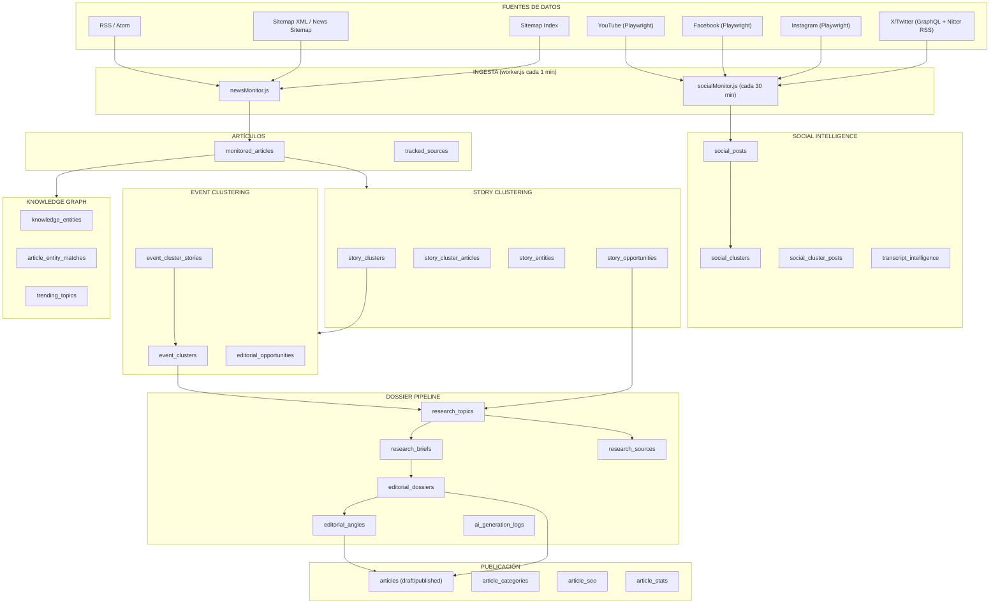

# AUDITORÍA ARQUITECTÓNICA COMPLETA — PANORAMA INFORMATIVO
*Basada exclusivamente en el código real del repositorio. Sin inferencias ni proyecciones.*

---

## FASE 1 — MAPA GENERAL



---

## FASE 2 — FUENTES

### Monitoreo de Medios (`tracked_sources`)

| Campo clave | Descripción |
|---|---|
| `rss_url` | URL del feed RSS/Sitemap a monitorear |
| `type` | `'news'` (por defecto) u otro clasificador |
| `check_interval` | Frecuencia de chequeo (default: 60 minutos) |
| `enabled` | Booleano de activación |
| `verification_status` | `'verified'`, `'approved'`, `'failed'` |
| `last_format_detected` | Formato XML detectado al verificar |

#### Formatos soportados (`detectXmlFormat` en `monitor.js`)

| Formato detectado | Label mostrado |
|---|---|
| `rss` / `atom` | RSS Feed / Atom Feed |
| `sitemap-index` | Sitemap Index |
| `news-sitemap` | Google News Sitemap |
| `urlset` | XML Sitemap (urlset) |
| `xml-generic` | XML genérico |
| `null` | No es XML (rechazado) |

La detección examina los primeros 1.000 caracteres del recurso para identificar el tipo por marcas de apertura (`<sitemapindex>`, `<urlset>`, `<rss>`, `<feed>`, etc.).

#### Frecuencia de ingesta
- El `worker.js` ejecuta `runNewsMonitor()` **cada 1 minuto** (cron `* * * * *`).
- Cada fuente define su propio `check_interval` (en minutos), respetado por el monitor.

#### Tablas principales utilizadas
- `tracked_sources` — catálogo de fuentes
- `source_verifications` — historial de verificaciones
- `monitored_articles` — artículos ingestados
- `settings` — flag `news_monitor_paused` para pausado administrativo

---

### Social Intelligence (`social_sources` / conectores)

#### Plataformas activas y mecanismo de acceso

| Plataforma | Clase | Mecanismo primario | Fallback |
|---|---|---|---|
| **YouTube** | `SocialFetcherYouTube*` | Playwright (DOM scraping por tab: videos, shorts, posts) | — |
| **Facebook** | `SocialFetcherPlaywrightFacebook` | Playwright anónimo (artículos `[role="article"]`) | GraphQL API interception (autenticado, si hay login wall) |
| **Instagram** | `SocialFetcherPlaywrightInstagram` | Playwright autenticado (cookie `sessionid`) | — |
| **X/Twitter** | `SocialFetcherX` | Playwright con session cookies (`X_AUTH_TOKEN`, `X_CT0`) → intercept GraphQL `UserTweets` | Nitter RSS (8 instancias de fallback) |

#### Variables de entorno requeridas por plataforma

| Plataforma | Variable | Uso |
|---|---|---|
| X/Twitter | `X_AUTH_TOKEN`, `X_CT0` | Cookies de sesión para GraphQL interception |
| Instagram | `INSTAGRAM_SESSION_ID` | Cookie `sessionid` inyectada en contexto Playwright |
| Facebook | `FB_PROFILE_DIR`, `FB_COOKIES_FILE` | Perfil persistente Playwright + cookies iniciales |
| X fallback | `NITTER_INSTANCE` | Instancia Nitter preferida (opcional; usa lista hardcodeada si no está) |

#### Frecuencia
- `runSocialMonitor()` ejecuta **cada 30 minutos** (cron `*/30 * * * *`).

#### Tablas utilizadas
- `social_sources` — catálogo de cuentas sociales
- `social_posts` — posts fetched
- `social_clusters` — clusters de posts similares
- `social_cluster_posts` — articulación post ↔ cluster
- `transcript_intelligence` — análisis de transcripciones de video

---

## FASE 3 — PROCESAMIENTO DE ARTÍCULOS (`newsMonitor.js`)

### Pipeline de ingesta

```
tracked_sources (enabled)
    ↓
Fetch XML (fetch API, User-Agent personalizado, timeout 12s)
    ↓
detectXmlFormat() → rss | atom | sitemap-index | news-sitemap | urlset
    ↓
Parse (según formato):
  - RSS/Atom   → items con <title>, <link>, <pubDate>, <description>
  - News Sitemap/urlset → <url> con <loc>, <lastmod>, <news:title>
  - Sitemap-Index → sub-sitemaps (fetched recursivamente, max 1 nivel)
    ↓
Dedup (URL en monitored_articles)
    ↓
INSERT INTO monitored_articles (title, url, summary, source_id, detected_at, published_at)
    ↓
Enrichment (content extraction):
  ├── fetch() HTTP + parser texto plano → extraction_method = 'fetch'
  ├── Playwright headless (fallback para JS-heavy)  → extraction_method = 'playwright'
  ├── Paywall/error → extraction_method = 'paywall'
  └── Sin enriquecimiento → extraction_method = 'rss_only'
    ↓
NER (Named Entity Recognition — algoritmo puro, sin IA)
  └── extractEntities(): tokenización por mayúsculas, stopwords en español/inglés,
      mínimo 2 chars, máximo 4 tokens
    ↓
INSERT/UPDATE knowledge_entities (entity_origin = 'MONITOR')
INSERT article_entity_matches
UPDATE trending_topics (mention_count, source_count, last_seen_at)
    ↓
Story Clustering 2.0 (detectStories)
    ↓
Freshness recalc (cada 30 min, independiente)
```

### NER — Implementación real
- Basada en regex de tokens con letra mayúscula.
- Lista de stopwords en `src/jobs/newsMonitor.js` (español + inglés, aprox. 200 palabras).
- No usa ningún modelo de lenguaje.
- Las entidades se clasifican según su `entity_type` (`MONITOR`) y se dedupen por nombre normalizado.

---

## FASE 4 — STORY CLUSTERING 2.0 (`detectStories`)

### Algoritmo de tres puertas (triple-gate)

```
Para cada artículo nuevo:
│
├── PUERTA 1 — Category Gate
│   detectStoryCategory(title, story_type) → 10 categorías posibles:
│   judicial | security | international | politics | economy |
│   health | technology | sports | entertainment | society
│   (basado en regex de keywords, con precedencia hardcodeada)
│   → Solo se compara el artículo contra clusters de la MISMA categoría
│
├── PUERTA 2 — Entity/Keyword Gate
│   ¿Comparte entidades o keywords específicos con un cluster existente?
│   → Si pasa: calcular similitud Jaccard
│
└── PUERTA 3 — Jaccard Threshold
    keyword_similarity + entity_similarity + title_similarity → relevance_score
    Umbral: relevance_score ≥ 0.30 para asignar al cluster
    Si no pasa ningún cluster → CREATE nuevo story_cluster
```

### Scoring de calidad (`story_context_score`)

| Componente | Peso | Base de cálculo |
|---|---|---|
| `context_relevance_score` | 35 pts | AVG `relevance_score` de artículos × 35 |
| `context_depth_score` | 25 pts | Palabras totales / 5000 (cap 1.0) × 25 |
| `context_diversity_score` | 15 pts | Fuentes distintas / 5 (cap 1.0) × 15 |
| `context_coverage_score` | 25 pts | % artículos `fetch`/`playwright` (vs `rss_only`) × 25 |

#### Niveles de calidad

| Score | `story_quality` | `story_confidence` |
|---|---|---|
| ≥ 70 (y fuentes > 1) | `excellent` | `high` (≥4 fuentes) |
| 45–69 | `good` | `medium` (2–3 fuentes) |
| 20–44 | `fair` | `low` (1 fuente) |
| < 20 | `poor` | |

#### Detección de contaminación
- Se activa cuando ≥25% de artículos tienen `category_match = false`.
- Requiere mínimo 4 artículos en el cluster.
- Escribe `contamination_flag = true` en `story_clusters`.
- No elimina asociaciones automáticamente (requiere revisión humana).

---

## FASE 5 — OPORTUNIDADES EDITORIALES

### Story Opportunities (`story_opportunities`)

Generadas algoritímicamente (sin IA) por `getCategoryOpportunityTemplates()`:
- Para cada categoría (10 categorías) existe un set de templates con scores preconfigurados.
- Se calculan: `traffic_score`, `urgency_score`, `editorial_score`, `seo_score`, `composite_score`.
- Trigger values: `'algorithmic'` o `'ai'` (campo `trigger`).
- Estados: `pending` → `in_progress` → `done` / `dismissed`.

### Editorial Opportunities (`editorial_opportunities`)
- Vinculadas a `event_clusters` (no a stories directamente).
- Campos: `type`, `title`, `reason`, `seo_value`, `traffic_potential`, `difficulty`.
- Se crean/reemplazan en `POST /events/:id/generate-summary` cuando la IA devuelve `editorial_opportunities`.

### Age buckets (en `/opportunities`)

| Bucket | Rango |
|---|---|
| `ACTIVE` | < 24 hs |
| `WARM` | 24–72 hs |
| `ARCHIVED` | > 72 hs |

---

## FASE 6 — KNOWLEDGE GRAPH

### Tablas del grafo

| Tabla | Descripción |
|---|---|
| `knowledge_entities` | Entidades canónicas (name, entity_type, mention_count, entity_origin) |
| `article_entity_matches` | Asociación artículo → entidad |
| `story_entities` | Asociación story_cluster → entidad |
| `entity_mentions` | Asociación research_topic → entidad (con confidence) |
| `trending_topics` | Entidades en tendencia (mention_count, source_count, last_seen_at) |

### `entity_origin` values
- `'MONITOR'` → extraída por el NER algorítmico del monitor de noticias.
- Entidades también pueden venir del pipeline de IA (AiService), clasificadas como `person`, `company`, `product`, `organization`, `location`.

### Event Clustering (`event_clusters`)
- Los `story_clusters` se agrupan en `event_clusters` mediante `event_cluster_stories`.
- Un event cluster acumula: `headline`, `summary`, `event_type`, `importance_score`, `editorial_score`, `coverage_status`, `main_entities[]`, `timeline[]`.
- `editorial_score` = score compuesto (impacto + fuentes + velocidad + artículos).
- `coverage_status`: `breaking` | `growing` | `monitoring` | `cooling`.

---

## FASE 7 — SOCIAL INTELLIGENCE (`socialMonitor.js`)

### Pipeline de ingesta social

```
social_sources (enabled)
    ↓
Dispatch por plataforma:
  ├── YouTube   → SocialFetcherYouTube*(Playwright)
  ├── Facebook  → SocialFetcherPlaywrightFacebook
  ├── Instagram → SocialFetcherPlaywrightInstagram
  └── X         → SocialFetcherX (GraphQL → Nitter fallback)
    ↓
Normalización → { platform, external_id, url, title, content,
                  thumbnail_url, video_url, published_at,
                  views, likes, comments, shares, engagement_score, keywords }
    ↓
Dedup por external_id en social_posts
INSERT INTO social_posts
    ↓
Transcript Intelligence (solo YouTube con video_url):
  ├── fetchTranscript() → Whisper (OpenAI)
  └── analyzeTranscript() → Claude (Anthropic)
  INSERT INTO transcript_intelligence
    ↓
Social Clustering (clusterNewPosts)
  └── Three-gate: Category → Keyword Jaccard → Threshold
      INSERT/UPDATE social_clusters, social_cluster_posts
    ↓
Opportunity metric calculation:
  └── traffic_score, viral_score, engagement_score por cluster
```

### Campos de métricas sociales

| Campo | Descripción |
|---|---|
| `engagement_score` | `likes + comments*2 + shares*3` |
| `views` | Vistas (0 si plataforma no lo expone) |
| `viral_score` | Calculado en clustering (composición de métricas) |

---

## FASE 8 — INTEGRACIÓN DE IA (`AiService.js`)

### Proveedor primario: Anthropic (Claude)

| Método | Trigger | Modelo | max_tokens | Output |
|---|---|---|---|---|
| `analyzeArticle()` | Enriquecimiento de artículo individual | `this.model` (por env) | 1000 | JSON: entities, events, summary |
| `generateTrendSummary()` | Umbral de artículos/fuentes en newsMonitor | claude | variable | JSON: resumen de tendencias |
| `generateDossier()` | Manual (`/dossiers/:id/enrich`) | claude | ~4000 | JSON: dossier completo con ángulos |
| `generateAngles()` | Manual (`/dossiers/:id/angles/refresh`) | claude | — | JSON: array de 4 ángulos |
| `regenerateAngle()` | Manual (`/dossiers/:id/angles/regenerate`) | claude | — | JSON: 1 ángulo |
| `generateArticleDraft()` | Manual (`/dossiers/:id/draft`) | claude | — | HTML body del artículo |
| `generateEventSummary()` | Manual (`/events/:id/generate-summary`) | claude | — | JSON: headline, summary, entities, timeline |
| `synthesizeKeyFacts()` | Previo a crear dossier desde story/event | claude | 1200 | JSON: array de hechos |
| `extractEntitiesFromArticle()` | Importación de investigación externa | claude | 1500 | JSON: entities + events |

### Proveedor secundario: OpenAI

| Método | Trigger | Servicio | Output |
|---|---|---|---|
| `transcribeAudio()` | YouTube video con audio | Whisper (`whisper-1`) | Texto transcripto |

### Gestión de costos (Cost Killer rules en código)
- **[Cost Killer 1]**: `AUTO_ANALYSIS_ENABLED` = false — el análisis individual de artículos está desactivado por defecto.
- **[Cost Killer 2]**: La creación de dossier deja el status en `'draft'` y no llama a IA automáticamente; el enriquecimiento requiere llamada manual a `POST /editorial-workflow/dossiers/:id/enrich`.
- **[Cost Killer 3]**: `coverage_status` e `importance_score` se calculan algorítmicamente, no con IA.
- **[Cost Killer 4]**: Las oportunidades editoriales de stories se generan con templates hardcodeados por categoría, sin IA.

### Gate de enriquecimiento para dossier
- No se genera dossier si < 70% de los artículos tienen `extraction_method IN ('fetch', 'playwright')`.
- El sistema devuelve HTTP 422 con el porcentaje actual de cobertura.

### Logging de uso de IA
- `ai_generation_logs`: registra `story_id`/`event_id`, `generation_type`, `article_count`, `article_titles[]`, `total_words_sent`.
- `aiUsageLogger.js`: función `logAiCall()` para event summaries con `feature`, `trigger`, `inputWords`, `durationMs`, `success`.

---

## FASE 9 — DOSSIER PIPELINE (`DossierService.js` + `editorial_workflow.js`)

### Flujo completo de creación de dossier

```
Trigger origin:
  ├── Story opportunity  → POST /opportunities/:id/create-dossier
  ├── Event cluster      → POST /events/:id/create-dossier
  └── Research topic     → POST /editorial-workflow/dossiers

    ↓ (transacción PostgreSQL)
INSERT research_topics → INSERT research_briefs
INSERT entity_mentions (desde story_entities o event entities)
INSERT research_sources (artículos fuente filtrados por relevance ≥ 0.30)
INSERT editorial_dossiers (status = 'draft')
UPDATE story_opportunities (status = 'in_progress')

    ↓ (gatillado manualmente)
POST /editorial-workflow/dossiers/:id/enrich
  → runDossierGeneration(dossierId, topic) [setImmediate — async]
    ↓
ai.generateDossier(title, brief, entities, sourceArticles)
  → Claude recibe: brief + artículos fuente (hasta 8, budget 50k chars)
    ↓
UPDATE editorial_dossiers:
  status = 'ready'
  executive_summary, verified_facts[], timeline[], entities[],
  seo_keywords[], suggested_categories[], suggested_tags[],
  suggested_headlines[], suggested_angles[], hero_image_prompt
    ↓
INSERT editorial_angles (ordenados: 'noticia' primero)
```

### Estructura de un ángulo editorial

```json
{
  "angle_type": "noticia|ultima_hora|cronica|analisis|investigacion|fact_check|explicador",
  "title": "50-60 chars",
  "summary": "2-3 oraciones",
  "target_audience": "string",
  "seo_keywords": ["kw1", "kw2", "kw3"]
}
```

### Regla de ordering de ángulos
- Posición 0: siempre `noticia`.
- Posición 1: `analisis` o `cronica`.
- Posición 2: `explicador` o `investigacion`.
- Posición 3: `fact_check` o `investigacion`.

---

## FASE 10 — PUBLICACIÓN (`articles.js`)

### Tabla `articles`

| Campo | Descripción |
|---|---|
| `title` | Titular del artículo |
| `slug` | URL-friendly, autogenerado y único |
| `volanta` | Antetítulo (opcional) |
| `epigraph` | Epígrafe de imagen (opcional) |
| `body` | HTML del cuerpo |
| `excerpt` | Resumen (max 500 chars) |
| `status` | `draft` \| `published` |
| `origin` | `manual` \| `research` \| `dossier` |
| `dossier_id` | UUID del dossier origen (si aplica) |
| `word_count` | Calculado automáticamente |
| `image_url` | URL de imagen de portada |
| `published_at` | Timestamp de publicación |
| `search_tsv` | Vector fulltext PostgreSQL (para búsqueda) |

### Tablas relacionadas
- `article_categories` — N:N con `categories`
- `article_seo` — 1:1 meta_title, meta_description, og_*, canonical_url, schema_json, keywords
- `article_stats` — inicializada al crear
- `comments` — comentarios públicos (count expuesto en listado)

### Control de acceso por rol

| Operación | Roles permitidos |
|---|---|
| Leer artículos publicados | Público (sin auth) |
| Leer borradores | `admin`, `editor` |
| Crear artículo | `admin`, `editor` |
| Editar artículo ajeno | Solo `admin` (editor solo el propio) |
| Eliminar | Solo `admin` |

### Exportación PDF (dossiers)
- `GET /editorial-dossiers/:id/pdf` usa Playwright `chromium.launch()` para renderizar HTML y exportar via `page.pdf()`.
- Formato A4, incluye: cronología, entidades, cobertura mediática, oportunidades editoriales.

---

## FASE 11 — FRESHNESS & SCORING

### Freshness (`recalcFreshness`)
- Ejecuta **cada 30 minutos** (cron independiente en `worker.js`).
- Aplica curva de decaimiento temporal:

| Rango | `freshness_score` |
|---|---|
| 0–2 hs | 1.00 |
| 2–6 hs | 0.90 |
| 6–12 hs | 0.75 |
| 12–24 hs | 0.50 |
| 24–48 hs | 0.25 |
| > 48 hs | 0.10 |

- Actualiza `freshness_score` en `story_clusters` y `event_clusters`.

### Revenue tracking
- `worker.js` ejecuta un cálculo de ingresos a las `00:05` diariamente.
- No hay código del cálculo visible directamente, pero la tarea existe en el scheduler.

---

## FASE 12 — INFRAESTRUCTURA Y ESTADO DEL PROYECTO

### Stack tecnológico confirmado

| Capa | Tecnología |
|---|---|
| Runtime | Node.js (ESM — `import/export`) |
| Framework API | Express.js |
| Base de datos | PostgreSQL (driver `pg`) |
| Scraping | Playwright (Chromium headless) |
| Cron/scheduler | `node-cron` |
| Validación | Zod |
| IA primaria | Anthropic SDK (`@anthropic-ai/sdk`) — Claude |
| IA secundaria | OpenAI SDK (`openai`) — Whisper |
| Autenticación | JWT (`requireAuth` middleware) |
| Roles | `requireRole('admin', 'editor')` middleware |

### Procesos del sistema

| Proceso | Comando | Responsabilidad |
|---|---|---|
| API Server | `npm run start` (`src/app.js`) | Expone REST API |
| Worker | `npm run worker` (`src/worker.js`) | Ejecuta crons de ingesta |
| CMS | `npm run cms` | Panel administrativo |

### Rutas API principales (`app.js`)

| Prefijo | Router |
|---|---|
| `/api/articles` | Publicación de artículos |
| `/api/monitor` | Gestión de fuentes y salud del sistema |
| `/api/events` | Event clusters y dossiers de eventos |
| `/api/opportunities` | Story opportunities |
| `/api/editorial-dossiers` | Dossiers editoriales (legacy view) |
| `/api/editorial-workflow` | Pipeline completo dossier/ángulos/drafts |
| `/api/social` | Social Intelligence |
| `/api/media` | Gestión de medios |
| `/api/ai` | Endpoints AI on-demand |

### Variables de entorno críticas

| Variable | Uso |
|---|---|
| `ANTHROPIC_API_KEY` | Claude (obligatorio para IA) |
| `OPENAI_API_KEY` | Whisper transcriptions |
| `X_AUTH_TOKEN`, `X_CT0` | X/Twitter GraphQL |
| `INSTAGRAM_SESSION_ID` | Instagram Playwright |
| `FB_PROFILE_DIR`, `FB_COOKIES_FILE` | Facebook persistent context |
| `NITTER_INSTANCE` | Instancia Nitter preferida (opcional) |
| `MONITOR_SQL_DEBUG` | Activa logging de queries SQL |
| `DATABASE_URL` | PostgreSQL connection string |

### Auditoría y herramientas de diagnóstico
- `GET /monitor/clustering-audit` — calidad de clusters, threshold simulation
- `GET /monitor/scoring-audit` — distribución de calidad por tier
- `GET /monitor/clustering-outliers` — stories huérfanas, contaminadas, high weak-link ratio
- `GET /monitor/scoring-integrity` — inconsistencias entre score y quality label
- `GET /monitor/health` — historial de worker runs (`worker_runs` table), estado operacional
- `GET /monitor/story/:id/explain` — trazabilidad completa de un story cluster
- `GET /monitor/worker-pause` + `POST /monitor/worker-pause` — pausa controlada del news monitor

---

*Fin de la auditoría. Todo el contenido está basado en código fuente real leído directamente de los archivos del repositorio.*
